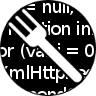

# Greasy Fork

**An open-source repository for user scripts and user styles.**

[Website](https://greasyfork.org) ·
[Forum](https://greasyfork.org/discussions/) ·
[Issues](https://github.com/greasyfork-org/greasyfork/issues) ·
[Contributing](https://github.com/greasyfork-org/greasyfork/wiki/Contributing-code) ·
[Translations](https://github.com/greasyfork-org/greasyfork/wiki/Translating-Greasy-Fork)

---

## About

[Greasy Fork](https://greasyfork.org) is an open-source platform for discovering, installing, publishing, and discussing user scripts and user styles.

This repository contains the application that powers Greasy Fork.

### What Greasy Fork provides

| Area | Description |
| --- | --- |
| **Discovery** | Browse and search user scripts and user styles for the websites you use. |
| **Publishing** | Publish, update, synchronize, and manage scripts. |
| **Community** | Discuss scripts, provide feedback, and interact with authors and other users. |
| **Moderation** | Report content and provide moderators with tools for reviewing and managing it. |
| **Localization** | Use Greasy Fork in multiple languages maintained by community translators. |
| **Integrations** | Synchronize scripts from external sources and use webhook-based updates. |

## Technology

Greasy Fork is primarily a Ruby on Rails application with a JavaScript frontend.

| Area | Technologies |
| --- | --- |
| **Backend** | Ruby, Ruby on Rails |
| **Frontend** | Turbo, Vite, JavaScript |
| **Database** | MySQL / MariaDB |
| **Background jobs** | Sidekiq, Redis |
| **Search** | Searchkick, Elasticsearch |
| **Testing** | Minitest, Capybara, Selenium |
| **Code editor** | Ace |
| **Charts** | Chart.js |
| **Localization** | Rails I18n, Transifex |

Exact dependency versions are defined in [`Gemfile`](Gemfile) and [`package.json`](package.json).

## Translations

Greasy Fork is available in multiple languages thanks to community translators.

English is the source locale. Translation resources are stored under [`config/locales`](config/locales), and the repository is configured to work with Transifex using [`.tx/config`](.tx/config).

To contribute a new translation or improve an existing one, see:

**[Translating Greasy Fork →](https://github.com/greasyfork-org/greasyfork/wiki/Translating-Greasy-Fork)**

## Contributing

Contributions to Greasy Fork are welcome.

For development environment setup and instructions on running Greasy Fork locally, see:

**[Running Greasy Fork locally →](https://github.com/greasyfork-org/greasyfork/wiki/Running-Greasy-Fork-locally)**

Before submitting code changes, also see the [contributing code guide](https://github.com/greasyfork-org/greasyfork/wiki/Contributing-code).

Other ways to contribute include:

- browsing and investigating [existing issues](https://github.com/greasyfork-org/greasyfork/issues);
- reviewing [open pull requests](https://github.com/greasyfork-org/greasyfork/pulls);
- helping [translate Greasy Fork](https://github.com/greasyfork-org/greasyfork/wiki/Translating-Greasy-Fork).

## Help and community

For help with Greasy Fork, user scripts, user script managers, or related topics, visit the:

**[Greasy Fork Forum →](https://greasyfork.org/discussions/)**

Development discussions and existing bug reports can also be found in the project's [GitHub issues](https://github.com/greasyfork-org/greasyfork/issues).

## Support Greasy Fork

Greasy Fork is free and open-source software.

If you find it useful, consider making a donation to help cover hosting costs. The suggested contribution is **$10**.

- [Donate via Stripe](https://donate.stripe.com/aEU03m025575fMk7ss)
- [Donate via PayPal or credit card](https://www.paypal.com/cgi-bin/webscr?cmd=_donations&business=jason.barnabe@gmail.com&item_name=Contribution+for+Greasy+Fork)

## License

Greasy Fork is licensed under the [GNU General Public License v3.0](COPYING).
